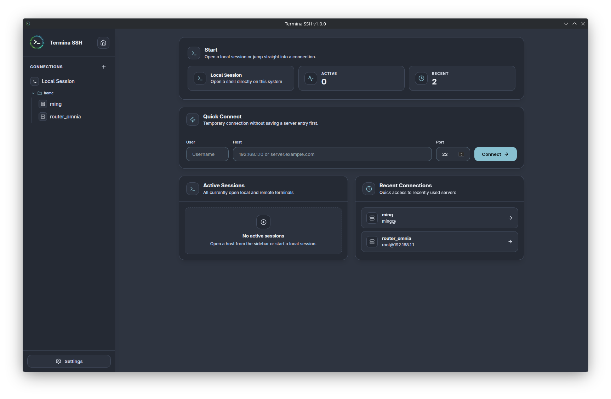
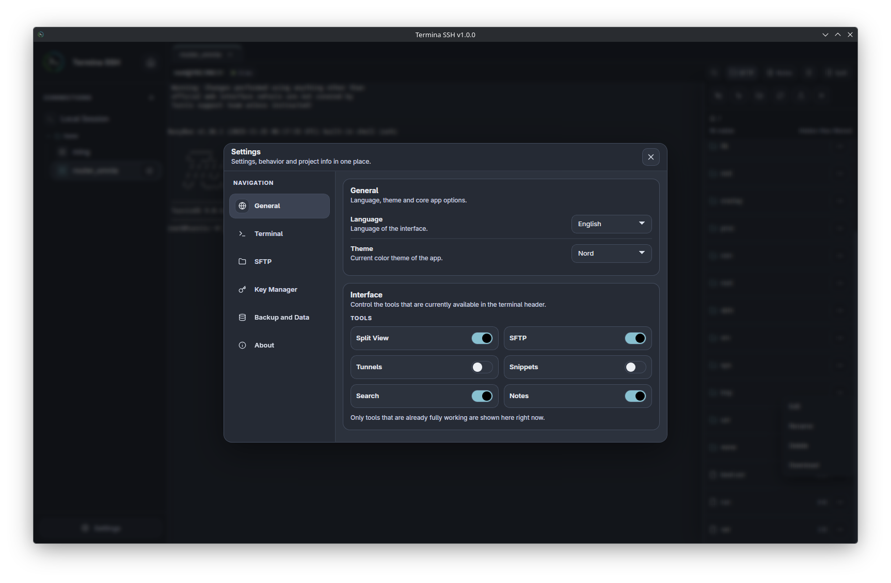
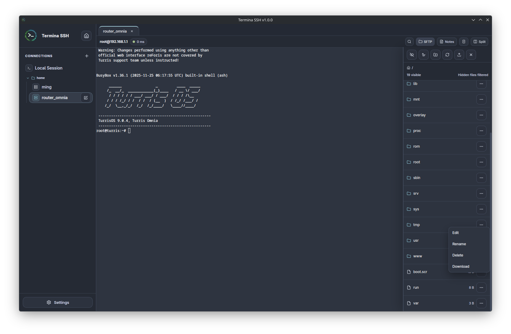
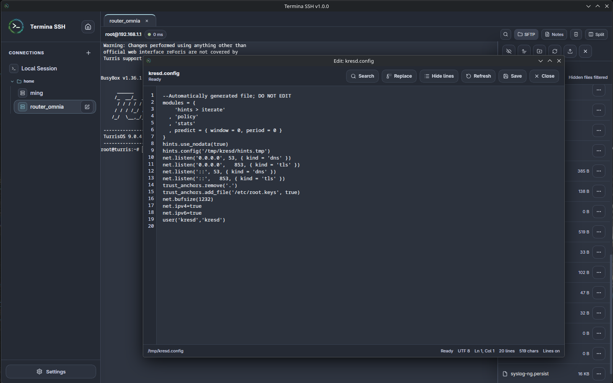

# Termina SSH

Termina SSH is a modern desktop SSH client focused on speed, clarity, and everyday workflow.

Built with Tauri, Rust, and React, it combines terminal sessions, SFTP, editing, tunnels, backups, and local workflows in a compact interface that stays practical across Linux, macOS, and Windows.

<p align="center">
  
</p>

## Overview

Termina SSH is designed for people who spend real time in terminals and want a native desktop app that feels fast, calm, and reliable.

The goal is simple. Keep the workflow focused, avoid unnecessary complexity, and cover the features that matter in daily use.

## What it includes

* Saved SSH connections
* Local terminal
* Tab based workflow
* Split terminal workflow
* Quick Connect
* Integrated SFTP browser
* Remote and local file editing
* Snippets
* SSH tunnels
* Notes
* Backup export and restore
* Optional encrypted backups
* Theme support
* System tray support

## Screenshots

<p align="center">
  
  &nbsp;
  
</p>

<p align="center">
  
</p>

## Highlights

### Focused terminal workflow

Termina SSH supports both local and remote sessions, tab based work, split panes, and quick access patterns that keep the interface efficient without feeling crowded.

### Integrated file workflow

The built in SFTP browser and editor make it possible to browse, upload, edit, and save files without jumping between multiple tools.

### Portable backups

Settings, connections, notes, snippets, keys, and tunnels can be exported and restored across systems. Encrypted backup export is available when you want additional protection.

### Native desktop feel

The app is built for Linux, macOS, and Windows with a focus on responsive interaction, clean layout, and platform appropriate behavior.

## Technology

* Frontend: React, Vite, TypeScript, Tailwind CSS
* Backend: Rust, Tauri v2
* Terminal engine: xterm.js
* Storage: local app data with exportable backup bundles

## Installation

Prebuilt binaries are available in [Releases](../../releases).

Current release assets include:

* Linux: `.deb`, `.rpm`, `.AppImage`
* Windows: `setup.exe`
* macOS: `.dmg`

## Development

### Prerequisites

* Node.js
* Rust and Cargo
* Tauri system dependencies for your platform

See the official Tauri prerequisites here:

https://v2.tauri.app/start/prerequisites/

### Clone and run

```bash
git clone https://github.com/kahikara/TerminaSSH.git TerminaSSH
cd TerminaSSH
npm install
npm run tauri dev
```

### Build

```bash
npm run tauri build
```

Release artifacts are generated in:

```text
src-tauri/target/release/bundle/
```

## Project direction

The current focus is continued polish across the core workflow:

* terminal and session UX
* SFTP and editor polish
* tunnel reliability
* cross platform refinement
* packaging quality

## Support

If you want to support development, you can do so here:

https://ko-fi.com/ming83

